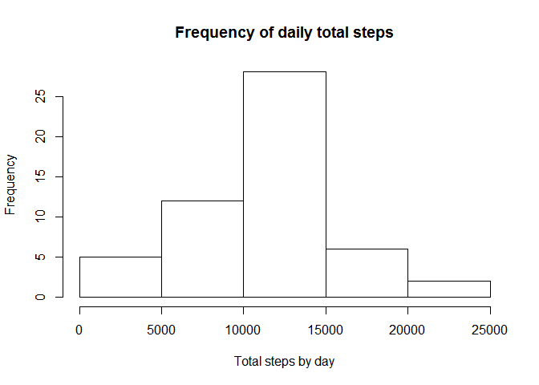
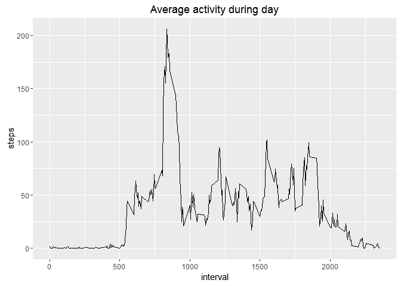
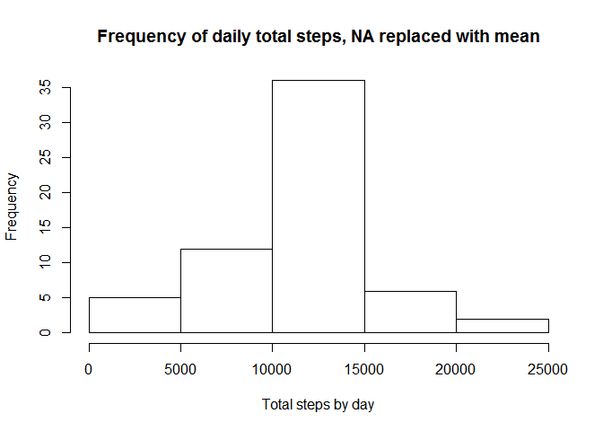
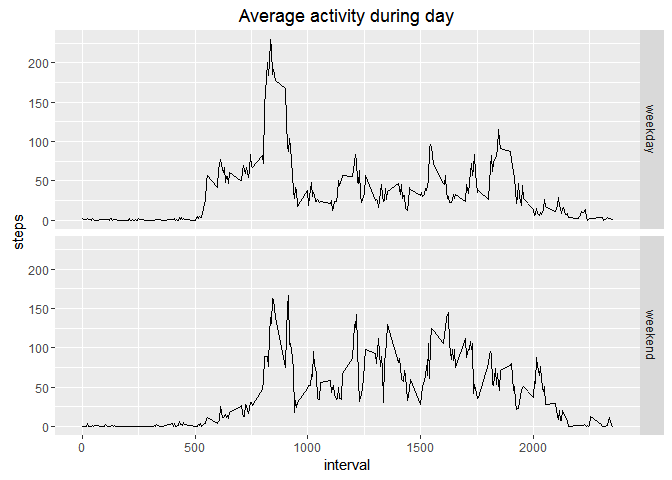

# Reproducible Research: Peer Assessment 1
Cesare Mauri  
28 gennaio 2016  

This is the solution for "Reproducible Research: Peer Assessment 1" part of Reproducible Research  by Coursera.
Ref: https://www.coursera.org/learn/reproducible-research/peer/gYyPt/course-project-1


## Prepare context and loading libraries

```r
rm(list=ls(all=TRUE))
setwd("C:/TInvention/DataScience/DS5-ReproducibileResearch/RepData_PeerAssessment1")
library(dplyr)
```

```
## 
## Attaching package: 'dplyr'
```

```
## The following objects are masked from 'package:stats':
## 
##     filter, lag
```

```
## The following objects are masked from 'package:base':
## 
##     intersect, setdiff, setequal, union
```

```r
library(ggplot2)
```

## Loading and preprocessing the data
Load the data (i.e. read.csv())
Process/transform the data (if necessary) into a format suitable for your analysis

```r
data <- read.table("activity.csv", header = T,sep=',')
data <- mutate(data, date=as.Date(date))
cleanData <- filter(data, !is.na(steps))
```

Histogram of the total number of steps taken each day

## What is mean and the median of total number of steps taken per day?
Make a histogram of the total number of steps taken each day

```r
cleanDataDaily <- group_by(cleanData,date)
infoByDay <- summarize(cleanDataDaily,totSteps=sum(steps))
hist(infoByDay$totSteps, 
     xlab = "Total steps by day",
     main = "Frequency of daily total steps")
```



Calculate and report the mean and median total number of steps taken per day

```r
mean(infoByDay$totSteps)
```

```
## [1] 10766.19
```

```r
median(infoByDay$totSteps)
```

```
## [1] 10765
```

## What is the average daily activity pattern?
Make a time series plot (i.e. type = "l") of the 5-minute interval (x-axis) and the average number of steps taken, averaged across all days (y-axis)

```r
cleanData5min <- group_by(cleanData,interval)
infoBy5Min <- summarize(cleanData5min,steps=mean(steps))
qplot(interval,steps,data=infoBy5Min,main="Average activity during day", geom="line")
```



Which 5-minute interval, on average across all the days in the dataset, contains the maximum number of steps?

```r
infoBy5Min[which.max(infoBy5Min$steps),]
```

```
## Source: local data frame [1 x 2]
## 
##   interval    steps
##      (int)    (dbl)
## 1      835 206.1698
```

## Imputing missing values
Calculate and report the total number of missing values in the dataset (i.e. the total number of rows with NAs)

```r
sum(is.na(data$step))
```

```
## [1] 2304
```

Devise a strategy for filling in all of the missing values in the dataset. The strategy does not need to be sophisticated. For example, you could use the mean/median for that day, or the mean for that 5-minute interval, etc.


```r
newData <- data

#for a given interval i get the mean of non NA values in the same interval
getSteps <- function(interval=0) {
   as.integer(round(infoBy5Min[which(infoBy5Min$interval==interval),2]))
}
```

Create a new dataset that is equal to the original dataset but with the missing data filled in.


```r
#replace missing value with the mean of other observations in same interval
for (i in which(is.na(newData))) {
    newData[i,]$steps <- getSteps(newData[i,]$interval)
}
sum(is.na(newData$step))
```

```
## [1] 0
```

Make a histogram of the total number of steps taken each day and Calculate and report the mean and median total number of steps taken per day. Do these values differ from the estimates from the first part of the assignment? What is the impact of imputing missing data on the estimates of the total daily number of steps?


```r
newDataDaily <- group_by(newData,date)
infoByDay <- summarize(newDataDaily,totSteps=sum(steps))
hist(infoByDay$totSteps, 
     xlab = "Total steps by day",
     main = "Frequency of daily total steps, NA replaced with mean")
```



```r
mean(infoByDay$totSteps)
```

```
## [1] 10765.64
```

```r
median(infoByDay$totSteps)
```

```
## [1] 10762
```
Mean and median are similar, now much more observations fall in middle segment

## Are there differences in activity patterns between weekdays and weekends?

For this part the weekdays() function may be of some help here. Use the dataset with the filled-in missing values for this part.

Create a new factor variable in the dataset with two levels – “weekday” and “weekend” indicating whether a given date is a weekday or weekend day.

```r
#use of wday instead of weekday to avoid locale problems
newData <- newData  %>% 
    mutate(dayType=ifelse(as.POSIXlt(date)$wday %in% c(0,6),"weekend","weekday")) %>%
    mutate(dayType=as.factor(dayType))
```

Make a panel plot containing a time series plot (i.e. type = "l") of the 5-minute interval (x-axis) and the average number of steps taken, averaged across all weekday days or weekend days (y-axis). See the README file in the GitHub repository to see an example of what this plot should look like using simulated data.

```r
#use of wday instead of weekday to avoid locale problems
newData5Min <- group_by(newData,dayType,interval)
infoBy5Min <- summarize(newData5Min,steps=mean(steps))
qplot(interval,steps,data=infoBy5Min,main="Average activity during day", geom="line", facets=dayType~.)
```



